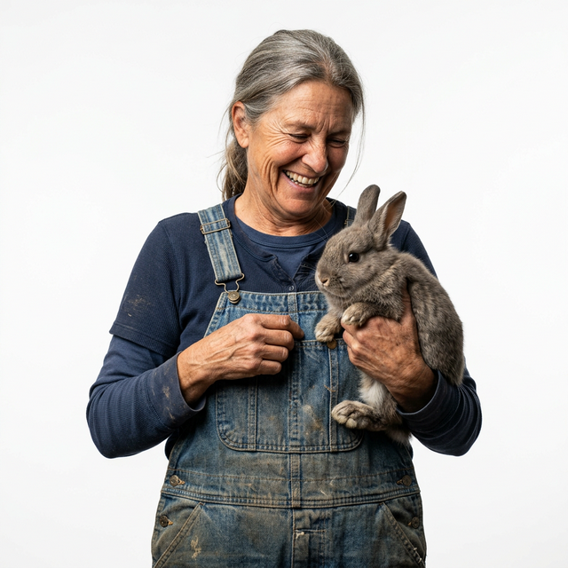
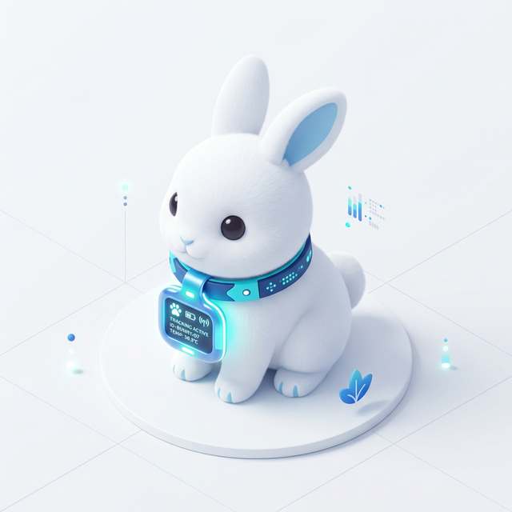
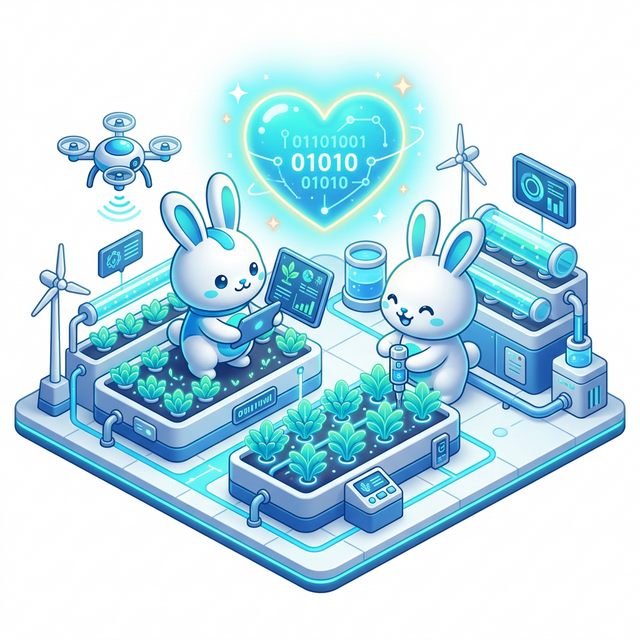
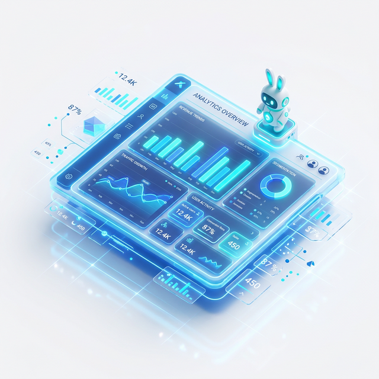

<div align="center">
  <h3>🌐 Sélectionner la langue / Select Language</h3>
  <p>
    <a href="https://github.com/lionel-hue/CuniApp" target="_blank">
      
    </a>
  </p>
</div>

> ⚠️ **NOTICE**: This software is **PROPRIETARY** and **CLOSED SOURCE**. See [LICENSE](./LICENSE) for terms. Unauthorized use, redistribution, or reproduction is strictly prohibited.

---

<div align="center">
  <h3>🌐 Sélectionner la langue / Select Language</h3>
  <p>
    <a href="#-cuniapp--gestion-d-élevage-cunicole-professionnel">🇫🇷 Français (Défaut)</a> | 
    <a href="#-cuniapp--professional-rabbit-breeding-management-system">🇺🇸 English</a>
  </p>
  <p>
    <a href="https://cuniapp.alwaysdata.net" target="_blank">
      
    </a>
  </p>
</div>

---

<details open>
<summary><b>🇫🇷 Cliquez pour voir en Français (Défaut)</b></summary>

# 🐇 CuniApp — Gestion d'Élevage Cunicole Professionnel

<div align="center">
  
  
  <p align="center">
    <strong>Une solution ERP complète pour la gestion d'exploitations cunicoles (élevages de lapins).</strong><br>
    Suivi reproductif, gestion commerciale, SaaS et pilotage multi-fermes.
  </p>

  [](https://laravel.com)
  [](https://tailwindcss.com)
  [](https://php.net)
  [](LICENSE)
</div>

---

## 🚀 À propos du Projet
**CuniApp** n'est pas seulement un outil de suivi : c'est un partenaire de gestion pour les éleveurs modernes. Qu'il s'agisse d'une petite exploitation ou d'une infrastructure multi-sites, CuniApp digitalise l'intégralité du cycle de vie de l'élevage, de la saillie à la vente finale.

<div align="center">
  <table>
    <tr>
      <td></td>
      <td></td>
    </tr>
    <tr align="center">
      <td><em>Mode Clair Édition Premium</em></td>
      <td><em>Mode Sombre Haute Performance</em></td>
    </tr>
  </table>
</div>

---

## ✨ Fonctionnalités Clés

### 🐰 Reproduction & Cheptel
- **Cycle complet** : Saillie ➜ Palpation ➜ Mise bas ➜ Sevrage.
- **Calcul automatique** : Dates de mise bas prévues calculées dynamiquement.
- **Historique complet** : Registre détaillé de toutes les portées par femelle.

### 💰 CRM & Business
- **Facturation PDF** : Génération immédiate de factures professionnelles.
- **Paiements** : Suivi des statuts (Payé, En attente, Partiel).
- **Ventes Groupées** : Gestion multis-lapidés en une seule transaction.

<div align="center">
  
</div>

### 💳 Infrastructure SaaS & Entreprise
- **Abonnements** : Plans d'essai et abonnements payants intégrés.
- **Paiements Locaux** : Intégration FedaPay (MoMo, Moov, Celtis).
- **Multi-Entreprises** : Gestion de fermes distinctes avec collaborateurs.

<div align="center">
  
</div>

---

## 🛠️ Stack Technologique
- **Framework** : Laravel 10
- **Frontend** : Tailwind CSS 3 & Alpine.js
- **Base de données** : MySQL 8+
- **Paiements** : API FedaPay

---

## 📖 Démarrage Rapide

<div align="center">
   ➔  ➔ 
</div>

```bash
git clone https://github.com/yamdev07/CuniApp.git
composer install && npm install
cp .env.example .env
php artisan migrate --seed
npm run dev & php artisan serve
```

---

## 👥 Équipe & Contributeurs

| Nom | Rôle | Liens |
| :--- | :--- | :--- |
| **Lionel HUE** | **Lead Developer** | [GitHub](https://github.com/lionel-hue) • [Portfolio](https://lionel-hue.github.io/portfolio/) |
| **Nafissath** | **IT Collaborator** | [GitHub](https://github.com/Nafissath) |
| **Yoann ADIGBONON** | **Product Owner** | [GitHub](https://github.com/yamdev07) • [LinkedIn](https://linkedin.com/in/yoann-adigbonon) |
| **Bellox1** | **Collaborator** | [GitHub](https://github.com/Bellox1) |
| **VODOUNON Majorelle** | **Collaborator** | [GitHub](https://github.com/VODOUNON-MAJORELLE) |

</details>

---

<details>
<summary><b>🇺🇸 Click to view in English</b></summary>

# 🐇 CuniApp — Professional Rabbit Breeding Management System

<div align="center">
  <p align="center">
    <strong>A complete ERP solution for managing cuniculiculture operations (rabbit farms).</strong><br>
    Reproduction tracking, commercial management, SaaS, and multi-farm governance.
  </p>
  <p>
    <a href="https://cuniapp.alwaysdata.net" target="_blank"><b>Live Demo</b></a>
  </p>
</div>

---

## 🚀 About the Project
**CuniApp** is more than just a tracking tool; it’s a management partner for modern breeders. From family farms to large multi-site infrastructures, CuniApp digitizes the entire livestock lifecycle.

### ✨ Key Features
- **Advanced Reproduction**: Full cycle tracking from mating to weaning.
- **Commercial CRM**: PDF invoicing and flexible payment tracking.
- **SaaS Infrastructure**: Native FedaPay integration and subscription management.
- **Enterprise Ready**: Multi-firm support with role-based access.

<div align="center">
  
  
</div>

---

## 👥 Team & Contributors

| Name | Role | Socials |
| :--- | :--- | :--- |
| **Lionel HUE** | **Lead Developer** | [GitHub](https://github.com/lionel-hue) • [Portfolio](https://lionel-hue.github.io/portfolio/) |
| **Nafissath** | **IT Collaborator** | [GitHub](https://github.com/Nafissath) |
| **Yoann ADIGBONON** | **Product Owner** | [GitHub](https://github.com/yamdev07) • [LinkedIn](https://linkedin.com/in/yoann-adigbonon) |
| **Bellox1** | **Collaborator** | [GitHub](https://github.com/Bellox1) |
| **VODOUNON Majorelle** | **Collaborator** | [GitHub](https://github.com/VODOUNON-MAJORELLE) |

</details>
